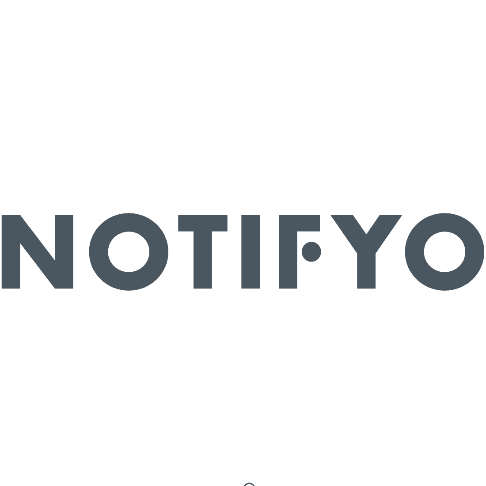

# Introduction

Notifyo is a self-hosted communication microservice. It comes as a standalone binary and the only dependency is a Mongo database.

## Developers
**notifyo** is a free and open source software licensed under common license. If you are interested in contributing, check out the [GitHub repository](https://github.com/iamc1oud/notifyo) and refer to the [developer setup](developer-setup). The backend is written in Go.